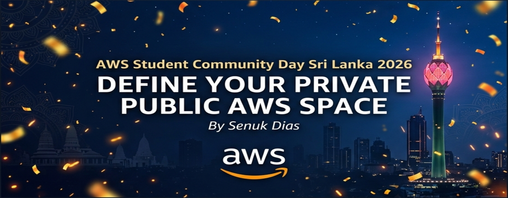
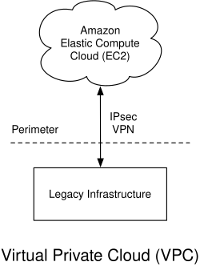
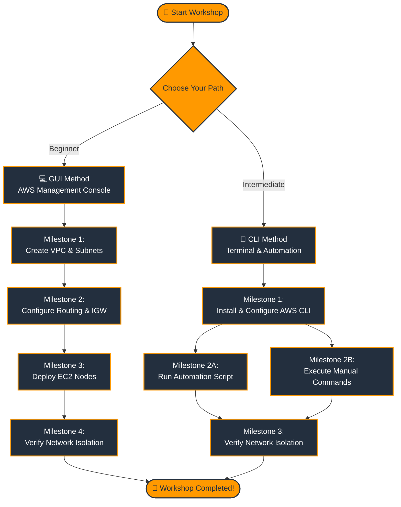

[](#)&ensp;
[](#)&ensp;

🎯 [Overview](#-high-level-overview) &ensp; 🧪 [Lab Instructions](#-lab-instructions)

> **✨ Learn to master AWS networking by building a secure, bifurcated Virtual Private Cloud.**

This guide walks you through deploying an AWS VPC architecture from scratch. You will learn the crucial difference between Public and Private subnets, how to manage routing for secure backend resources, and how to verify your network isolation.

Think of this as your foundational step toward building secure, production-ready cloud environments.

## 🏗️ High-Level Overview

```mermaid
graph TD
    User((👨‍💻 User))
    
    subgraph "AWS Cloud Region"
        IGW[🌐 Internet Gateway]
        
        subgraph "VPC (10.0.0.0/16)"
            direction TB
            
            subgraph "Public Subnet (10.0.1.0/24)"
                Web[💻 Public Web Node<br>Jump Host]
                RT_Pub[🗺️ Public Route Table<br>0.0.0.0/0 ➡️ IGW]
            end
            
            subgraph "Private Subnet (10.0.2.0/24)"
                DB[🗄️ Private DB Node]
                RT_Priv[🗺️ Main Route Table<br>Local Routing Only]
            end
        end
    end

    User -->|Internet Traffic| IGW
    IGW <--> RT_Pub
    RT_Pub -.-> Web
    
    Web ===>|SSH via Jump Node| DB
    RT_Priv -.-> DB

    classDef pubSubnet fill:#e6f3ff,stroke:#0077b6,stroke-width:2px,color:#03045e
    classDef privSubnet fill:#fde2e4,stroke:#c1121f,stroke-width:2px,color:#780000
    classDef vpcBorder fill:none,stroke:#ff9900,stroke-width:3px,stroke-dasharray: 5 5
    classDef awsNode fill:#ff9900,stroke:#232f3e,stroke-width:2px,color:#fff
    
    class "Public Subnet (10.0.1.0/24)" pubSubnet
    class "Private Subnet (10.0.2.0/24)" privSubnet
    class "VPC (10.0.0.0/16)" vpcBorder
    class IGW,Web,DB awsNode
```

A bifurcated network architecture separates infrastructure into **Public** and **Private** subnets to enhance security. 

-  **Public Subnet**: Contains resources that require direct access to the internet, such as web servers, NAT gateways, or load balancers. These subnets have a route to an Internet Gateway (IGW).
-  **Private Subnet**: Contains backend resources that should not be directly accessible from the internet, such as databases or application servers. These subnets do not have a route to an IGW. They rely on Bastion Hosts (Jump Nodes) in the public subnet for inbound SSH access.

## 🗺️ Learning Path & Milestones

The following flowchart outlines the exact milestones you will complete during this workshop, depending on the learning path you choose.



## 🚀 Start the Lab

[](./01-introduction.md)

### 🛤️ Choose Your Path

After completing the introduction and setup, choose your preferred method to deploy the infrastructure:

[](./02a-gui-milestone1-vpc-subnets.md)
[](./03a-cli-milestone1-vpc-subnets.md)

*(Note: Both paths achieve the same final architecture. The CLI path includes a ready-to-run automation script: `deploy-vpc.sh`)*

---

## 🤝 Connect With Me
- 💼 **LinkedIn**: [linkedin.com/in/senukdias](https://www.linkedin.com/in/senukdias)
- 📱 **WhatsApp Channel**: [Join Here](https://whatsapp.com/channel/0029Van2p0gC6ZvfT0TjC10Y)
- 📸 **Instagram**: [@senukdias](https://www.instagram.com/senukdias)
- 👥 **Facebook**: [facebook.com/senukdias](https://www.facebook.com/senukdias)

## License
This project is licensed under the terms of the MIT open source license.
