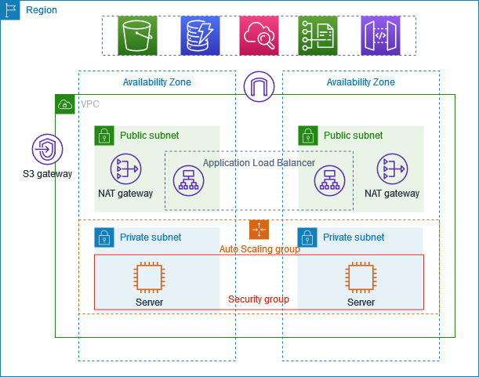

---


[](#)&ensp;
[](#)&ensp;

🎯 [Overview](#-high-level-overview) &ensp; ✅ [GUI Deployment](#-gui-deployment-guide-vpc--networking) &ensp; 🚀 [CLI Deployment](#-automation-script) &ensp; 🔍 [Verification](#-verification)

> **✨ Learn to master AWS networking by building a secure, bifurcated Virtual Private Cloud.**

This guide walks you through deploying an AWS VPC architecture from scratch. You will learn the crucial difference between Public and Private subnets, how to manage routing for secure backend resources, and how to verify your network isolation.

Think of this as your foundational step toward building secure, production-ready cloud environments.

## 🏗️ High-Level Overview

<picture>
  
</picture>

A bifurcated network architecture separates infrastructure into **Public** and **Private** subnets to enhance security. 

-  **Public Subnet**: Contains resources that require direct access to the internet, such as web servers, NAT gateways, or load balancers. These subnets have a route to an Internet Gateway (IGW).
-  **Private Subnet**: Contains backend resources that should not be directly accessible from the internet, such as databases or application servers. These subnets do not have a route to an IGW. They rely on Bastion Hosts (Jump Nodes) in the public subnet for inbound SSH access.

## 💻 GUI Deployment Guide: VPC & Networking

Follow these steps to deploy the VPC architecture via the AWS Management Console:

### 1. Create the VPC
1. Navigate to the **VPC Dashboard**.
2. Click **Create VPC** and select **VPC only**.
3. **Name tag**: `my-bifurcated-vpc`.
4. **IPv4 CIDR block**: `10.0.0.0/16`.
5. Click **Create VPC**.

### 2. Create Subnets
1. Go to **Subnets** > **Create subnet**.
2. Select your VPC: `my-bifurcated-vpc`.
3. **Configure Public Subnet**:
   - **Name**: `public-subnet-1` | **AZ**: Choose one (e.g., `us-east-1a`) | **CIDR**: `10.0.1.0/24`
4. Click **Add new subnet** to configure the private subnet:
   - **Name**: `private-subnet-1` | **AZ**: Same zone | **CIDR**: `10.0.2.0/24`
5. Click **Create subnet**.

### 3. Internet Gateway (IGW) & Routing
1. Go to **Internet Gateways** > **Create internet gateway** (Name: `my-igw`). Attach it to `my-bifurcated-vpc`.
2. Go to **Route Tables**. Your main route table is your **Private Route Table**.
3. **Create Public Route Table**: Name it `public-route-table` for `my-bifurcated-vpc`.
4. Edit routes for `public-route-table`: Add `0.0.0.0/0` -> Target `my-igw`.
5. Edit subnet associations for `public-route-table`: Select `public-subnet-1`. *(Private subnet stays implicitly associated with the main route table).*

## 🚀 Deploying EC2 Nodes

1. **Deploy Public EC2 Web Node (Jump Node)**:
   - **VPC/Subnet**: `my-bifurcated-vpc` / `public-subnet-1`.
   - **Public IP**: Enable.
   - **Security Group**: Allow SSH (22) and HTTP (80) from Anywhere.
2. **Deploy Private EC2 Database Node**:
   - **VPC/Subnet**: `my-bifurcated-vpc` / `private-subnet-1`.
   - **Public IP**: Disable.
   - **Security Group**: Allow SSH (22) from the `public-web-node`'s security group.

## 📜 Automation Script
Want to skip the console? You can automate this entire setup using our AWS CLI Bash script.

Run the script locally:
```bash
chmod +x deploy-vpc.sh
./deploy-vpc.sh
```

## 🔍 Verification

Verify the network isolation and accessibility of your setup.

### 1. Direct Access to Private Node (Should Fail)
Attempt to ping or SSH directly into your private node using its Private IP. 
```bash
ssh -i "my-aws-key.pem" ec2-user@<PRIVATE_IP>
```
*Result: Connection times out. The private node has no route to the internet.*

### 2. Access via Jump Node (Should Succeed)
SSH into your public jump node:
```bash
ssh -i "my-aws-key.pem" ec2-user@<PUBLIC_IP>
```
From inside the public node, SSH into the private node using the same key (using SCP or SSH Agent Forwarding):
```bash
ssh -i "my-aws-key.pem" ec2-user@<PRIVATE_IP>
```
*Result: You successfully log in, proving internal accessibility within the VPC.*

---

## 🤝 Connect With Me
- 💼 **LinkedIn**: [linkedin.com/in/senukdias](https://www.linkedin.com/in/senukdias)
- 📱 **WhatsApp Channel**: [Join Here](https://whatsapp.com/channel/0029Van2p0gC6ZvfT0TjC10Y)
- 📸 **Instagram**: [@senukdias](https://www.instagram.com/senukdias)
- 👥 **Facebook**: [facebook.com/senukdias](https://www.facebook.com/senukdias)

## License
This project is licensed under the terms of the MIT open source license.
